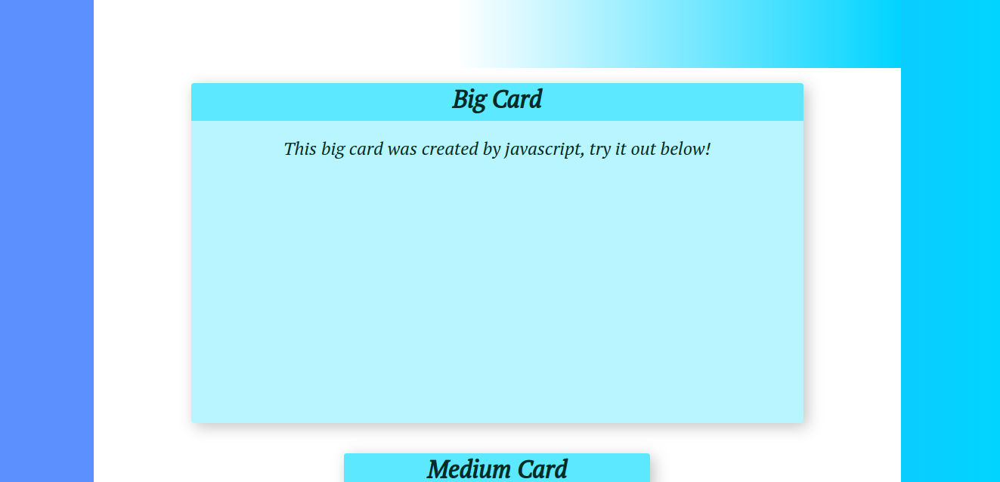

# Card Creator(Frontend Project)

## Technologies used: HTML, CSS and Vanilla JavaScript

## How to run
Just run "index.html" in your browser and it should be enough.

## Description

Simple frontend project where you create "cards" containing a title and his content, later being added in a main container

## Gallery

